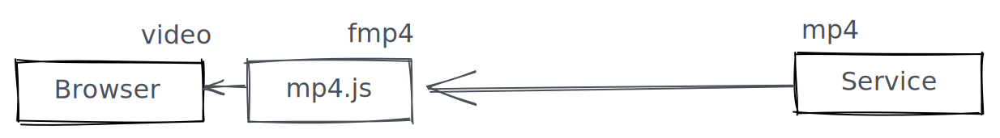

<p align="center">


---


</p>

### Introduction

mp4.js is a library that convert mp4 to fmp4 at browser-side in time. it supports web player can play remote mp4 video file as stream.

Usually web player can play ordinary mp4 file by video,but it can't control loading media data or switch media resource smoothly.


If you use mp4.js than can load any media data as any indicated time,because it can analyze meta information and get binaray data without changing by service.




### Usage

the package provides three version such as commonjs、esmodule、umd.

```node
npm install mp4.js
```

```html
<video id="player" autoplay controls width="1280" height="640"></video>
```

```js
const MP4 = require('mp4.js')
const mp4 = MP4('./xgplayer-demo-720p.mp4')
const video = document.querySelector('#player')
function loadData (i = 0, time = video.currentTime) {
  if (timer) {
    clearTimeout(timer)
  }
  timer = setTimeout(() => {
    mp4.seek(time + i * 0.1).then(buffer => {
      if (buffer) {
        mse.updating = true
        mse.appendBuffer(buffer)
        mse.once('updateend', () => {
          mse.updating = false
        })
      }
    }, (error) => {
      if (i < 10) {
        timer = setTimeout(() => {
          this.loadData(i + 1)
        }, 2000)
      }
    })
  }, 50)
}
let mse
let timer
mp4.on('moovReady', function () {
  mse = new MP4.MSE()
  video.src = mse.url
  mse.on('sourceopen', () => {
    mse.appendBuffer(mp4.packMeta())
    mse.once('updateend', loadData)
  })
  video.addEventListener('timeupdate', function () {
    loadData(1)
  })
})
```

you can reffer more code in examples directory.

### Examples

you can visit [xgplayer website](https://v2.h5player.bytedance.com/examples/) to experience it. if you just develop locally by reffering [github examples](https://github.com/bytedance/mp4.js/examples/)


### API

#### MP4 Class

```js
let mp4 = new MP4(url,options,chunkSize)
```

| parameter  | description   |  optional  |
| ------- | ---------------- |   ------- |
| url    | parameter requires remote address of mp4 file which supports CORS | false  |
| options | parameter include withCredentials and videoOnly | true |
| chunkSize | parameter means data length per request which help minimize the network traffic | true |


**Method**

```js
mp4.getData(start,end,chunkSize)
```

| parameter | description | optional |
| --------- | ----------- | -------- |
| start     | parameter requires initial position by byte  |  false  |
| end | parameter requires end position by byte | false|
| chunkSize | parameter means data length number per request | true |
| return | Promise instance which outputs object incaluding xhr state | - |


Usually you need't use it directly because MP4 provides advanced interface. Of course you can use it control more details.

```js
mp4.getMetaInfo(start,end)
```

| parameter | description | optional |
| --------- | ----------- | -------- |
|   start   | parameter requires initial position by byte,default is zero      |  false   |
|   end     | parameter requires end position by byte        |    true      |


this interface can get basic information about the mp4 file such as ftyp、moov、mdat. if succees it will trigger 'moovReady' event and the property mp4.meta is available.

```js
mp4.packMeta()
```
| parameter | description |
| --------- | ----------- |
| return    | Array.buffer |

You know the moov box is indifferent between mp4 and fmp4,so we need repack the moov box. you just call the function once when MSE initialize because it includes ftyp and moov box.


```js
mp4.seek(currentTime)
```

| parameter | description | optional |
| --------- | ----------- | -------- |
|currentTime| parameter require video.currentTime         |  false   |
| return    | Promise Instance which return Array.buffer              |    -     |

in most time, the interface is enough.

```js
mp4.clear()
```

empty mse buffer cache and download cache.

**Event**

```js
mp4.once('moovReady',handle)
mp4.once('error',handle)
```

#### MP4.MSE Class

```js
let mse = new MP4.MSE(codecs)
```
| parameter | description | optional |
| --------- | ----------- | -------- |
| codecs    |parameter is optional,default values is 'video/mp4; codecs="avc1.64001E, mp4a.40.5"'               |    true  |
|  return   |   MSE instance          |    -      |


MP4.MSE extends raw MSE API and Event.

### Other

if you're interested in this package, [xgplayer](https://www.npmjs.com/package/xgplayer) and [xgplayer-mp4](https://www.npmjs.com/package/xgplayer-mp4) is better way to learn that gives more usage and compatibility in products.

### License

[MIT](https://opensource.org/licenses/MIT)
